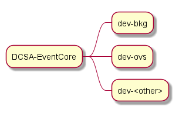

# DCSA Event Core

The repository contains event functionality shared among different applications, i.e. the DCSA Event API functionality.
It is packaged as a jar, and uploaded to GitHub packages, to be downloaded via Maven

### To build manually, run:
```
mvn clean install -nsu
```

If you need any of the Services, Controllers or Repositories required by
this module, then you may have to explicitly define `basePackages` in the 
`@ComponentScan` and `@EnableR2dbcRepositories` annotation.  For DCSA implementations, the
following definition should work:

```
@ComponentScan(basePackages = "org.dcsa")
@EnableR2dbcRepositories(basePackages = {"org.dcsa"}, repositoryBaseClass = ExtendedRepositoryImpl.class)
```

If you need more control over it, then all the repositories from the
DCSA Event Core are isolated in `org.dcsa.core.events.repositories`.

---------------------------------------------------------------------------------------------------------------------

### DEVELOPMENT FLOW

We have development branches for each project, branching from **master**. \
_ex. dev-bkg, dev-ovs, etc_



- The branches will be merged with master at the close of a sprint, with a bumped up event core version.
- The development branch will be rebased with master at the start of a sprint.

This allows us to limit the number of bumps in version during development.

Each project has a **dev** CI which build against the respective development branch in DCSA-Event-Core.

> While working with **development branches** we recommend importing **DCSA-Core** and **DCSA-Event-Core** as modules into \
> individual projects (ex. DCSA-BKG, DCSA-OVS, etc.) over using the maven import to avoid issues. \
> If on **master** the maven import works just fine.

A typical flow would look like (_using DCSA-BKG as an example_) :
1) Changes required in DCSA-Event-Core are pushed to **dev-bkg** branch. This triggers a snapshot build.
2) We then push the changes in the respective feature branches within DCSA-BKG, this triggers a CI to use the\
the snapshot created by **dev-bkg** to build DCSA-BKG. Verifying everything is in sync.
3) At the end of a sprint, we bump the DCSA-Event-Core version and merge with master. 
4) Tag DCSA-Event-Core.
5) Rebase **dev-bkg** with the latest master if any other changes are present.
6) Continue development.
